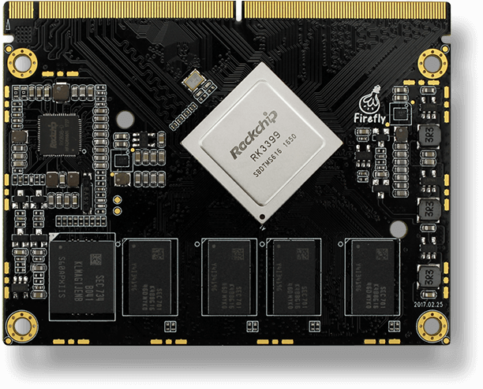

# RK3399_BLADE_V1.4 (Shadow Ghost hardware)

- https://fccid.io/2AQ6C-SG01
- http://opensource.rock-chips.com/wiki_RK3399
- https://www.rockchip.fr/
- http://opensource.rock-chips.com/wiki_Boot_option
- http://www.orangepi.org/orangepiplus2/
- https://github.com/u-boot/u-boot/blob/master/doc/README.rockchip


- https://www.theobroma-systems.com/rk3399-q7-user-manual/03-using-the.evk.html
- ft232r usb uart driver https://ftdichip.com/drivers/

```
1.5 Mbps 8N1
```

The evaluation board contains an on-board Silicon Labs CP2102N USB-serial converter. Connect the included Micro-USB cable to the Micro-USB jack labeled USB-UART Bridge:

The serial converter does not require additional drivers on Windows and Linux.

For Mac OS, drivers are available from Silicon Labs: http://www.silabs.com/products/development-tools/software/usb-to-uart-bridge-vcp-drivers

The Q7 modules has two external UARTs:

UART0 is, by default, used for the serial console for interactive login.
UART1 is unused by default and can be freely used for machine-to-machine communications or other purposes.
The switch UART0 / UART1 cross-switches UART0 and UART1 between the RS232 / RS485 jack and the onboard USB-serial converter:

Switch Position	RS232 / RS485 jack connected to:	USB-serial converter connected to:
UART0	UART0 (interactive console)	UART1
UART1	UART1	UART0 (interactive console)
For interactive login through the USB-serial converter, make sure the switch is on the UART1 position

Picocom can be used to connect via the serial line (assuming the USB-serial converter is USB0):

picocom -b 115200 /dev/ttyUSB0
Note
Make sure to disable software flow-control (XON/XOFF). Otherwise serial input may not be recognized.

After system bootup, the login console appears on the terminal:

rk3399-q7 login:
You can log in as root with password root or as user user with password user.

https://en.t-firefly.com/product/coreboard/core_3399

